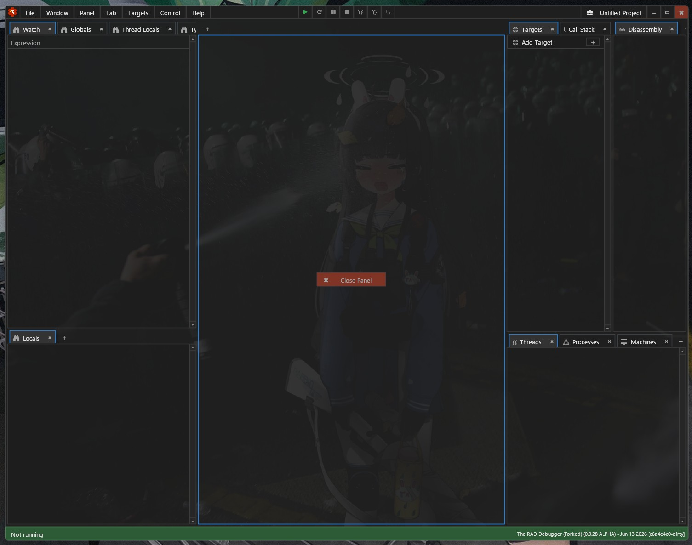

# The RAD Debugger Project (Forked)

Go read the original repo. This is just my own thingy because I needed a background image.  
The background is embeded into the executable. So to customize you have to build it from source
For that read the original README.md as well as the section below

## How to do it (read to the end)

The only thing to be done is to add background.png into data/
next regenerate the metadata (inside the proper msvc env)

```bash
build meta raddbg
```

I don't add my background because I don't own it

(only tested with msvc)

The last step is to modify the background color of the theme to a color with an opacity

btw the positioning is a type of fit anchored to the top left corner of the window

## Demo ヽ( ￣ヮ￣)ノ


